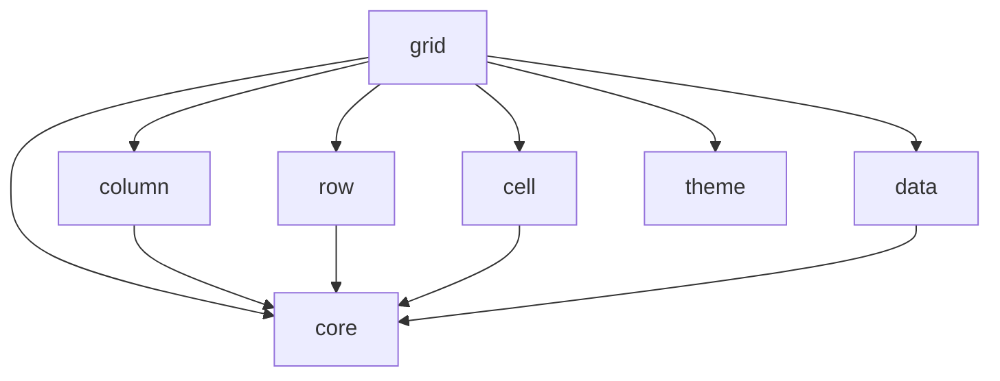

# AI Assistant Guide for BLG Grid Development

This document provides comprehensive context for AI coding assistants (Claude, Gemini, ChatGPT, GitHub Copilot, etc.) to understand and work with the BLG Grid codebase effectively.

## 🎯 Project Overview

**BLG Grid** is an enterprise-grade Angular data grid component library that rivals ag-grid in functionality while being specifically optimized for Angular applications. It's built from scratch using modern Angular 20+ with Signals and standalone components.

### Key Characteristics
- **Clean-room implementation**: No ag-grid code was used; built from public specifications only
- **Angular-native**: Leverages Angular Signals for optimal performance
- **Production-ready**: Handles 500k+ rows with virtual scrolling
- **Fully tested**: 94% code coverage with 500+ tests
- **Comprehensively documented**: 70+ documentation files
- **MIT licensed**: Free for commercial use

## 🏗️ Architecture Overview

### Technology Stack
```yaml
Framework: Angular 20.1.0
Language: TypeScript 5.5+
Build System: Nx 21.4.1
Testing: Jest + Playwright
Styling: SCSS with CSS Variables
Package Manager: npm
State Management: Angular Signals
Components: Standalone (no NgModules)
```

### Project Structure
```
blg-sdk-ng-grid/
├── docs/                    # All documentation (70+ files)
├── blg-grid/               # Main Angular workspace
│   ├── libs/               # Library packages (7 modules)
│   │   ├── core/          # Core interfaces, types, services
│   │   ├── grid/          # Main grid component
│   │   ├── column/        # Column operations
│   │   ├── row/           # Row operations
│   │   ├── cell/          # Cell rendering/editing
│   │   ├── data/          # Data management
│   │   └── theme/         # Theming system
│   ├── apps/              # Demo applications
│   ├── e2e/               # E2E tests (Playwright)
│   └── dist/              # Build output
├── README.md              # Project overview
└── CLAUDE.md             # This file
```

### Module Dependencies


## 💡 Key Concepts

### 1. Signal-Based Architecture
The entire state management uses Angular Signals for optimal reactivity:

```typescript
// Example from GridStateService
export class GridStateService {
  private _columns = signal<ColumnDefinition[]>([]);
  private _data = signal<any[]>([]);
  private _selectedRows = signal<Set<any>>(new Set());
  
  // Computed signals for derived state
  readonly visibleColumns = computed(() => 
    this._columns().filter(col => !col.hidden)
  );
  
  readonly sortedData = computed(() => {
    // Sorting logic using signals
  });
}
```

### 2. Virtual Scrolling Strategy
- Automatically enabled for datasets > 50 rows
- Uses Angular CDK Virtual Scrolling
- Optimized buffer sizes for smooth scrolling
- Handles variable row heights

### 3. Performance Optimizations
- OnPush change detection throughout
- TrackBy functions for all lists
- Memoized computations
- Debounced operations
- DOM recycling for virtual scrolling

### 4. Component Architecture
All components are standalone with clear responsibilities:
- **Grid**: Main container, orchestrates features
- **Column**: Header rendering, sorting, resizing
- **Row**: Row rendering, selection
- **Cell**: Cell rendering, editing
- **Filters**: Type-specific filter components

## 🔧 Development Guidelines

### Code Style
```typescript
// Use signals for state
private _state = signal<State>(initialState);

// Use computed for derived values
readonly derivedValue = computed(() => this._state().value * 2);

// Use effect for side effects
effect(() => {
  console.log('State changed:', this._state());
});

// Always use trackBy
trackByFn = (index: number, item: any) => item.id || index;

// Prefer early returns
if (!data) return;
// ... rest of logic
```

### Testing Requirements
- Minimum 80% code coverage
- Test files next to source files (*.spec.ts)
- Use TestBed for component tests
- Mock external dependencies
- Test accessibility features

### Performance Targets
- Initial render: < 1s for 10k rows
- Scroll performance: 30+ FPS
- Memory usage: Linear scaling
- Bundle size: < 200KB gzipped

## 📋 Common Tasks

### Adding a New Feature
1. Create feature branch from main
2. Add interfaces to `libs/core/src/lib/interfaces/`
3. Implement in appropriate module
4. Add unit tests (*.spec.ts)
5. Add E2E tests if UI-facing
6. Update documentation
7. Update demo app

### Creating a New Component
```typescript
import { Component, input, output, signal } from '@angular/core';

@Component({
  selector: 'blg-feature',
  standalone: true,
  imports: [CommonModule],
  template: `...`,
  changeDetection: ChangeDetectionStrategy.OnPush
})
export class FeatureComponent {
  // Inputs using new signal syntax
  data = input.required<any[]>();
  config = input<Config>();
  
  // Outputs
  changed = output<ChangeEvent>();
  
  // Internal state
  private _state = signal<State>(defaultState);
}
```

### Working with Filters
Filters are type-specific components in `libs/grid/src/lib/filters/`:
- TextFilterComponent
- NumberFilterComponent
- DateFilterComponent
- BooleanFilterComponent

Each implements a common interface and emits filter changes.

### State Management Pattern
```typescript
// Service handles state
@Injectable()
export class FeatureService {
  private _state = signal<State>({...});
  readonly state = this._state.asReadonly();
  
  updateState(partial: Partial<State>) {
    this._state.update(current => ({...current, ...partial}));
  }
}

// Component consumes state
export class Component {
  private service = inject(FeatureService);
  state = this.service.state; // Use in template with state()
}
```

## 🐛 Known Issues & Solutions

### Issue: Import path inconsistencies
**Solution**: Always use `@blg/*` imports, not `@blg-grid/*`

### Issue: Virtual scrolling performance
**Solution**: Ensure trackBy is implemented and itemSize is set

### Issue: Change detection not triggering
**Solution**: Use signals and computed() for reactive state

### Issue: Memory leaks in large datasets
**Solution**: Implement proper cleanup in ngOnDestroy

## 🚀 Build & Deployment

### Development
```bash
cd blg-grid
npm install
npm run serve  # Start dev server on :4200
```

### Building
```bash
npm run build        # Build all libraries
npm run build:grid   # Build specific library
```

### Testing
```bash
npm test            # Unit tests
npm run test:e2e    # E2E tests
npm run test:perf   # Performance tests
```

### Publishing
```bash
npm run build
cd dist/libs/grid
npm publish --access public
```

## 📊 Performance Characteristics

### Virtual Scrolling
- Activates at 50+ rows
- Buffer: 10-20 items
- Handles 500k+ rows
- 30+ FPS scrolling

### Memory Usage
- 100k rows: 150-300MB
- 250k rows: 300-600MB
- 500k rows: 500MB-1GB

### Bundle Sizes
- Core: ~30KB
- Grid: ~100KB
- Total: ~150KB (gzipped)

## 🔍 Debugging Tips

### Enable Debug Mode
```typescript
// In main.ts
if (!environment.production) {
  enableDebugTools(appRef.components[0]);
}
```

### Performance Profiling
```typescript
// Use performance marks
performance.mark('render-start');
// ... rendering logic
performance.mark('render-end');
performance.measure('render', 'render-start', 'render-end');
```

### State Debugging
```typescript
// Log signal changes
effect(() => {
  console.log('State:', this._state());
}, { allowSignalWrites: true });
```

## 📚 Important Files to Understand

### Core Files
- `libs/grid/src/lib/grid/grid.ts` - Main grid component (1200+ lines)
- `libs/core/src/lib/services/grid-state.service.ts` - State management
- `libs/core/src/lib/interfaces/grid-config.interface.ts` - Configuration

### Test Files
- `libs/grid/src/test-utilities/test-utils.ts` - Test utilities
- `e2e/screenshots/capture-screenshots.spec.ts` - Screenshot tests
- `e2e/performance/extreme-performance.spec.ts` - Performance tests

### Documentation
- `docs/INDEX.md` - Documentation entry point
- `docs/contributing/architecture-overview.md` - Architecture details
- `docs/maintainers/signal-architecture.md` - Signals implementation

## 🎯 Current Priorities

1. **Tree Data Support** - Hierarchical data display (planned v2.0)
2. **Advanced Filtering UI** - Filter builder interface
3. **Server-Side Row Model** - For infinite scrolling
4. **Column Groups** - Grouped column headers
5. **Integrated Charting** - Sparklines and charts

## 💬 Communication & Support

### For Questions
1. Check `docs/` folder first
2. Look for similar patterns in codebase
3. Review test files for usage examples

### Code Review Focus
- Performance implications
- Accessibility compliance
- Test coverage
- Documentation updates
- Breaking changes

## 🔒 Security Considerations

- No external API calls in library code
- Sanitize all user inputs
- Escape HTML in cell renderers
- Validate export data
- No eval() or Function() usage

## ✅ Checklist for AI Assistants

When working on this project:

- [ ] Use Angular Signals for state management
- [ ] Write TypeScript with strict mode compliance
- [ ] Add comprehensive JSDoc comments
- [ ] Include unit tests for new code
- [ ] Update relevant documentation
- [ ] Follow Angular style guide
- [ ] Consider performance implications
- [ ] Ensure accessibility compliance
- [ ] Use semantic HTML
- [ ] Implement proper error handling

## 🎨 UI/UX Guidelines

- Follow Material Design principles
- Ensure keyboard navigation works
- Provide visual feedback for actions
- Support dark/light themes
- Maintain 44px minimum touch targets
- Use ARIA labels appropriately
- Test with screen readers

## 📝 Final Notes

This is a production-ready library that prioritizes:
1. **Performance** - Handle large datasets efficiently
2. **Developer Experience** - Clear APIs and documentation
3. **Accessibility** - WCAG 2.1 AA compliance
4. **Maintainability** - Clean, tested, documented code
5. **Modern Angular** - Latest features and best practices

When in doubt, refer to the existing patterns in the codebase or check the comprehensive documentation in the `docs/` folder.

---

**Remember**: This is a clean-room implementation. Do not copy code from ag-grid or other proprietary sources. All implementations should be original or based on publicly available specifications.