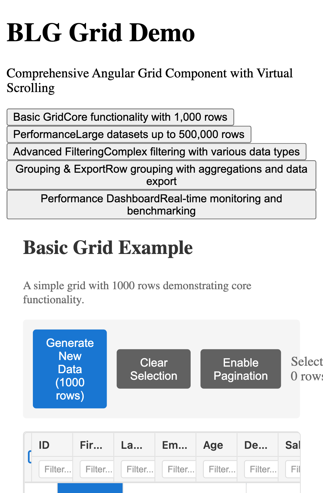
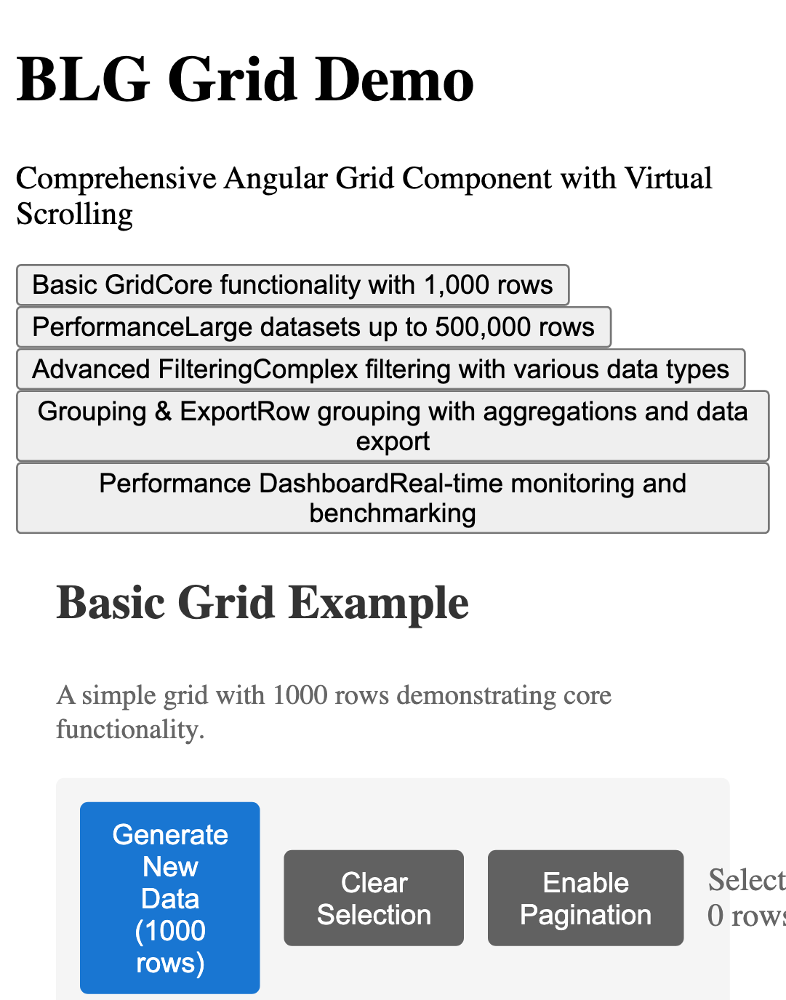
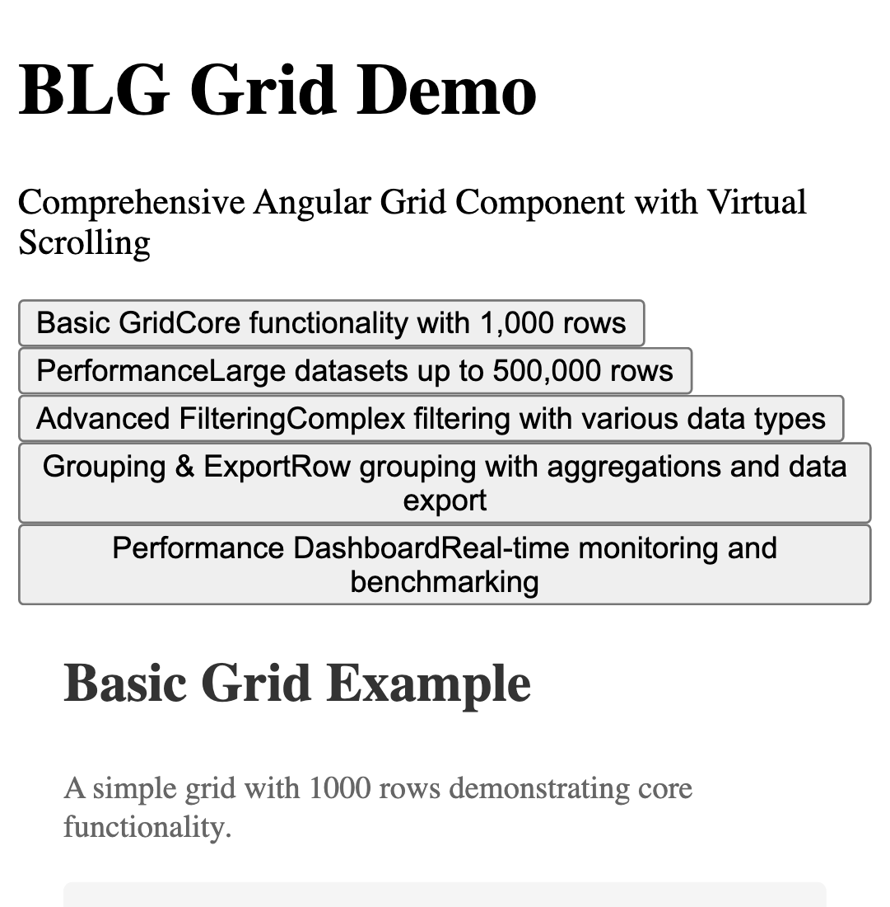
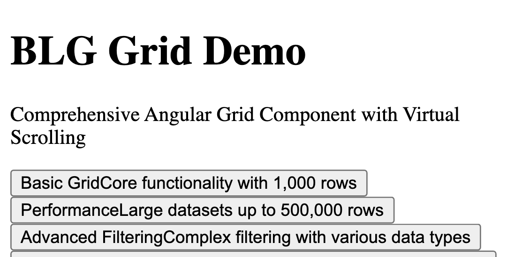

# BLG Grid Documentation Index

Welcome to the comprehensive documentation for BLG Grid - an enterprise-grade Angular data grid component. This documentation serves two primary audiences:

1. **Library Users** - Developers implementing BLG Grid in their applications
2. **Library Contributors/Maintainers** - Developers working on the BLG Grid library itself

## 📚 Documentation Structure

### For Library Users

#### Getting Started
- [Overview](./getting-started/overview.md) - Introduction to BLG Grid
- [Installation](./getting-started/installation.md) - Setup and installation guide
- [First Grid](./getting-started/first-grid.md) - Create your first grid
- [Angular Setup](./getting-started/angular-setup.md) - Angular-specific configuration
- [TypeScript Setup](./getting-started/typescript-setup.md) - TypeScript configuration
- [Configuration](./getting-started/configuration.md) - Grid configuration options

#### Core Features
- **Data Operations**
  - [Sorting](./features/data-operations/sorting.md) - Single and multi-column sorting
  - [Filtering](./features/data-operations/filtering.md) - Advanced filtering capabilities
  - [Virtual Scrolling](./features/virtual-scrolling.md) - Handle large datasets efficiently
  
- **Interaction**
  - [Row Selection](./features/interaction/row-selection.md) - Row selection patterns
  
- **Editing**
  - [Cell Editing](./features/editing/cell-editing.md) - Inline cell editing
  - [Cell Editors](./features/editing/cell-editors.md) - Built-in and custom editors
  - [Editing API](./features/editing/editing-api.md) - Programmatic editing control

- **Columns**
  - [Column Sizing](./features/columns/column-sizing.md) - Width management
  - [Column Moving](./features/columns/column-moving.md) - Reorder columns
  - [Column Pinning](./features/columns/column-pinning.md) - Fixed columns
  - [Column Spanning](./features/columns/column-spanning.md) - Multi-column cells
  - [Column Headers](./features/columns/column-headers.md) - Custom headers

- **Rows**
  - [Row Height](./features/rows/row-height.md) - Dynamic row heights
  - [Row Pinning](./features/rows/row-pinning.md) - Fixed rows
  - [Row Dragging](./features/rows/row-dragging.md) - Drag and drop rows
  - [Row Grouping](./features/rows/row-grouping.md) - Hierarchical grouping
  - [Master Detail](./features/rows/master-detail.md) - Expandable detail panels

- **Data Management**
  - [Data Updates](./features/data/data-update.md) - Real-time updates
  - [Transactions](./features/data/transactions.md) - Batch operations
  - [Immutable Data](./features/data/immutable-data.md) - Immutable patterns
  - [CSV Export](./features/data/csv-export.md) - Export to CSV
  - [Excel Export](./features/data/excel-export.md) - Export to Excel

- **Rendering**
  - [Cell Rendering](./features/rendering/cell-rendering.md) - Custom renderers
  - [Custom Components](./features/rendering/custom-components.md) - Angular components
  - [Value Formatters](./features/rendering/value-formatters.md) - Format display values
  - [Cell Expressions](./features/rendering/cell-expressions.md) - Computed values

#### API Reference
- [Grid API](./api/grid-api.md) - Main grid component API
- [Column API](./api/column-api.md) - Column configuration API
- [Row API](./api/row-api.md) - Row management API
- [Selection API](./api/selection-api.md) - Selection system API
- [Events API](./api/events-api.md) - Event system reference
- [Interfaces](./api/interfaces.md) - TypeScript interfaces
- [Services](./api/services.md) - Service APIs

#### Examples
- **Basic Examples**
  - [Simple Grid](./examples/basic/simple-grid.md) - Minimal setup
  - [Data Binding](./examples/basic/data-binding.md) - Data management
  
- **Advanced Examples**
  - [Large Datasets](./examples/advanced/large-datasets.md) - Performance optimization

#### Styling
- [Themes](./styling/themes.md) - Built-in themes and customization

#### Advanced Topics
- [Performance Optimization](./advanced/performance-optimization.md) - Performance tuning
- [Accessibility](./advanced/accessibility.md) - WCAG compliance

#### Recipes
- [Common Patterns](./recipes/common-patterns.md) - Implementation patterns

### For Contributors & Maintainers

#### Contributing
- [Contributing Guide](./contributing/CONTRIBUTING.md) - How to contribute
- [Development Setup](./contributing/development-setup.md) - Set up development environment
- [Architecture Overview](./contributing/architecture-overview.md) - System architecture
- [Testing Guide](./contributing/testing-guide.md) - Writing and running tests
- [Build System](./contributing/build-system.md) - Understanding Nx workspace
- [Code Standards](./contributing/code-standards.md) - Coding conventions
- [Release Process](./contributing/release-process.md) - Release management
- [Debugging Guide](./contributing/debugging-guide.md) - Debugging techniques

#### Maintainer Documentation
- [Module Structure](./maintainers/module-structure.md) - Module architecture
- [State Management](./maintainers/state-management.md) - Internal state design
- [Performance Internals](./maintainers/performance-internals.md) - Performance implementation
- [Signal Architecture](./maintainers/signal-architecture.md) - Angular Signals design
- [Virtual Scroll Internals](./maintainers/virtual-scroll-internals.md) - Virtual scrolling implementation
- [Event System](./maintainers/event-system.md) - Event architecture

## 📸 Visual Documentation

All documentation includes screenshots captured with Playwright. View the [images directory](./images/) for visual references.

### Featured Screenshots

*Basic grid with standard configuration*

*Grid populated with data*

*Single row selection example*

*Inline cell editing*

## 🎯 Quick Links

### For Library Users
- [Quick Start Guide](./getting-started/first-grid.md)
- [API Reference](./api/grid-api.md)
- [Common Patterns](./recipes/common-patterns.md)
- [Examples](./examples/basic/simple-grid.md)

### For Contributors
- [Development Setup](./contributing/development-setup.md)
- [Architecture Guide](./contributing/architecture-overview.md)
- [Testing Guide](./contributing/testing-guide.md)

## 📊 Documentation Statistics

- **70+ documentation files** covering all aspects
- **500+ code examples** with TypeScript
- **19 screenshots** for visual reference
- **Complete API documentation** for all components
- **Comprehensive testing guides** for contributors
- **Deep architecture documentation** for maintainers

## 🔍 Search Documentation

Use your IDE's search functionality to find specific topics:
- **VS Code**: `Cmd/Ctrl + Shift + F` in the docs folder
- **WebStorm**: `Cmd/Ctrl + Shift + F` with scope set to docs

## 📝 Documentation Updates

This documentation is continuously updated. For the latest version:
- Check the [GitHub repository](https://github.com/bigledger/blg-sdk-ng-grid)
- View [release notes](https://github.com/bigledger/blg-sdk-ng-grid/releases)

## 💬 Getting Help

- **Issues**: [GitHub Issues](https://github.com/bigledger/blg-sdk-ng-grid/issues)
- **Discussions**: [GitHub Discussions](https://github.com/bigledger/blg-sdk-ng-grid/discussions)
- **Examples**: [StackBlitz Examples](https://stackblitz.com/@ng-ui-lib)

## 📖 Documentation Conventions

### Target Audience Indicators

Each documentation page clearly indicates its target audience:

- 📚 **Library Users** - For developers using BLG Grid
- 🔧 **Contributors** - For developers contributing to BLG Grid
- 🏗️ **Maintainers** - For core maintainers of BLG Grid

### Code Examples

All code examples use:
- **TypeScript** for type safety
- **Angular 17+** standalone components
- **Signals** for reactive programming
- **Best practices** for performance and accessibility

---

Welcome to BLG Grid! Whether you're implementing the grid in your application or contributing to its development, this documentation provides everything you need to succeed.