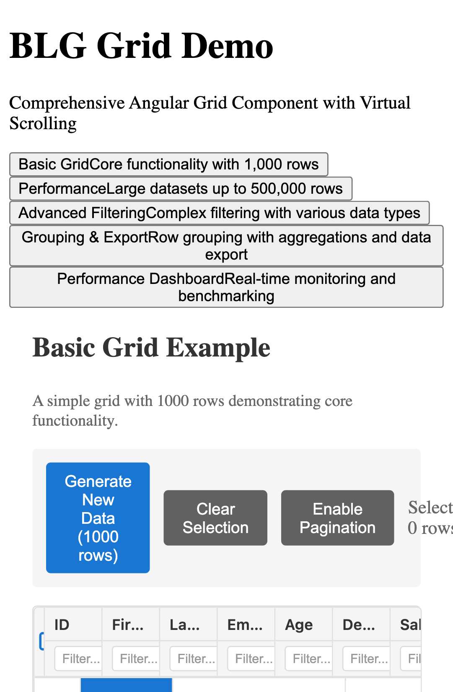

# Basic Configuration

This guide covers the essential configuration options for BlgGrid to get you up and running quickly.



*A basic BLG Grid with default configuration*

## Grid Configuration

The `GridConfig` interface defines the main configuration options for your grid:

```typescript
import { GridConfig } from '@ng-ui-lib/core';

const gridConfig: GridConfig = {
  // Row settings
  rowHeight: 40,                    // Height of each row in pixels
  totalRows: 1000,                  // Total number of rows (auto-calculated from data)
  
  // Performance
  virtualScrolling: true,           // Enable virtual scrolling for large datasets
  
  // Features
  sortable: true,                   // Enable column sorting
  filterable: true,                 // Enable column filtering
  selectable: true,                 // Enable row selection
  selectionMode: 'multiple',        // 'single' or 'multiple'
  resizable: true,                  // Enable column resizing
  reorderable: true,                // Enable column reordering
  
  // UI
  theme: 'default',                 // Grid theme
  showFooter: false                 // Show/hide footer
};
```

## Column Configuration

Define how your columns should behave and appear:

```typescript
import { ColumnDefinition } from '@ng-ui-lib/core';

const columnDefs: ColumnDefinition[] = [
  {
    id: 'name',                     // Unique identifier
    field: 'name',                  // Property name in data object
    header: 'Full Name',            // Display header text
    width: 200,                     // Column width in pixels
    minWidth: 100,                  // Minimum width when resizing
    maxWidth: 300,                  // Maximum width when resizing
    sortable: true,                 // Enable sorting for this column
    filterable: true,               // Enable filtering for this column
    resizable: true,                // Enable resizing for this column
    visible: true,                  // Show/hide column
    type: 'string',                 // Data type: 'string' | 'number' | 'date' | 'boolean'
    align: 'left',                  // Text alignment: 'left' | 'center' | 'right'
    pinned: undefined               // Pin column: 'left' | 'right' | undefined
  }
];
```

## Data Types

BlgGrid supports different data types with automatic formatting and filtering:

### String Columns
```typescript
{
  id: 'description',
  field: 'description',
  header: 'Description',
  type: 'string',
  align: 'left'
}
```

### Number Columns
```typescript
{
  id: 'price',
  field: 'price',
  header: 'Price ($)',
  type: 'number',
  align: 'right',
  width: 120
}
```

### Date Columns
```typescript
{
  id: 'created',
  field: 'createdDate',
  header: 'Created',
  type: 'date',
  width: 150
}
```

### Boolean Columns
```typescript
{
  id: 'active',
  field: 'isActive',
  header: 'Active',
  type: 'boolean',
  width: 100,
  align: 'center'
}
```

## Selection Configuration

Configure how row selection works in your grid:

### Single Selection
```typescript
const config: GridConfig = {
  selectable: true,
  selectionMode: 'single'
};
```

### Multiple Selection
```typescript
const config: GridConfig = {
  selectable: true,
  selectionMode: 'multiple'
};
```

### Disable Selection
```typescript
const config: GridConfig = {
  selectable: false
};
```

## Virtual Scrolling

For optimal performance with large datasets, enable virtual scrolling:

```typescript
const config: GridConfig = {
  virtualScrolling: true,
  rowHeight: 40  // Consistent row height required for virtual scrolling
};
```

**Important:** Virtual scrolling requires:
- Consistent row height (`rowHeight` must be specified)
- Works best with datasets larger than 1000 rows
- Improves performance significantly for 10,000+ rows

## Complete Example

Here's a comprehensive example combining all configuration options:

```typescript
import { Component } from '@angular/core';
import { Grid } from '@ng-ui-lib/grid';
import { ColumnDefinition, GridConfig } from '@ng-ui-lib/core';

interface ProductData {
  id: number;
  name: string;
  category: string;
  price: number;
  inStock: boolean;
  createdDate: Date;
  description: string;
}

@Component({
  selector: 'app-product-grid',
  standalone: true,
  imports: [Grid],
  template: `
    <div class="grid-container">
      <ng-ui-lib 
        [data]="products" 
        [columns]="columns" 
        [config]="config"
        (rowSelect)="onRowSelect($event)"
        (cellClick)="onCellClick($event)"
        (columnSort)="onColumnSort($event)">
      </ng-ui-lib>
    </div>
  `,
  styles: [`
    .grid-container {
      height: 600px;
      width: 100%;
      margin: 20px 0;
    }
  `]
})
export class ProductGridComponent {
  columns: ColumnDefinition[] = [
    {
      id: 'id',
      field: 'id',
      header: 'ID',
      type: 'number',
      width: 80,
      pinned: 'left',
      sortable: true
    },
    {
      id: 'name',
      field: 'name',
      header: 'Product Name',
      type: 'string',
      width: 200,
      sortable: true,
      filterable: true,
      resizable: true
    },
    {
      id: 'category',
      field: 'category',
      header: 'Category',
      type: 'string',
      width: 150,
      sortable: true,
      filterable: true
    },
    {
      id: 'price',
      field: 'price',
      header: 'Price',
      type: 'number',
      width: 120,
      align: 'right',
      sortable: true,
      filterable: true
    },
    {
      id: 'inStock',
      field: 'inStock',
      header: 'In Stock',
      type: 'boolean',
      width: 100,
      align: 'center',
      sortable: true
    },
    {
      id: 'createdDate',
      field: 'createdDate',
      header: 'Created',
      type: 'date',
      width: 150,
      sortable: true
    },
    {
      id: 'description',
      field: 'description',
      header: 'Description',
      type: 'string',
      width: 300,
      resizable: true,
      filterable: true
    }
  ];

  config: GridConfig = {
    rowHeight: 45,
    virtualScrolling: true,
    sortable: true,
    filterable: true,
    selectable: true,
    selectionMode: 'multiple',
    resizable: true,
    reorderable: true,
    theme: 'default',
    showFooter: true
  };

  products: ProductData[] = [
    {
      id: 1,
      name: 'Laptop Pro',
      category: 'Electronics',
      price: 1299.99,
      inStock: true,
      createdDate: new Date('2024-01-15'),
      description: 'High-performance laptop for professionals'
    },
    // Add more sample data...
  ];

  onRowSelect(event: any) {
    console.log('Row selected:', event);
  }

  onCellClick(event: any) {
    console.log('Cell clicked:', event);
  }

  onColumnSort(event: any) {
    console.log('Column sorted:', event);
  }
}
```

## Configuration Tips

### Performance Optimization
- Use `virtualScrolling: true` for datasets > 1000 rows
- Set appropriate `rowHeight` for your content
- Limit the number of simultaneously sortable/filterable columns

### User Experience
- Set reasonable default column widths
- Use appropriate data types for automatic formatting
- Consider pinning important columns (`pinned: 'left'`)
- Enable features progressively based on user needs

### Responsive Design
- Set `resizable: true` to allow users to adjust columns
- Use percentage-based container widths
- Consider hiding less important columns on smaller screens

## Next Steps

- [Data Binding](../features/data-binding.md) - Learn different data binding approaches
- [Column Configuration](../features/column-configuration.md) - Advanced column features
- [Event Handling](../features/event-handling.md) - Handle grid events
- [Styling and Themes](../features/theming.md) - Customize grid appearance